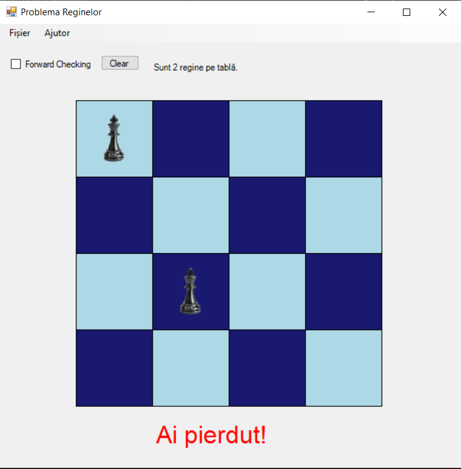
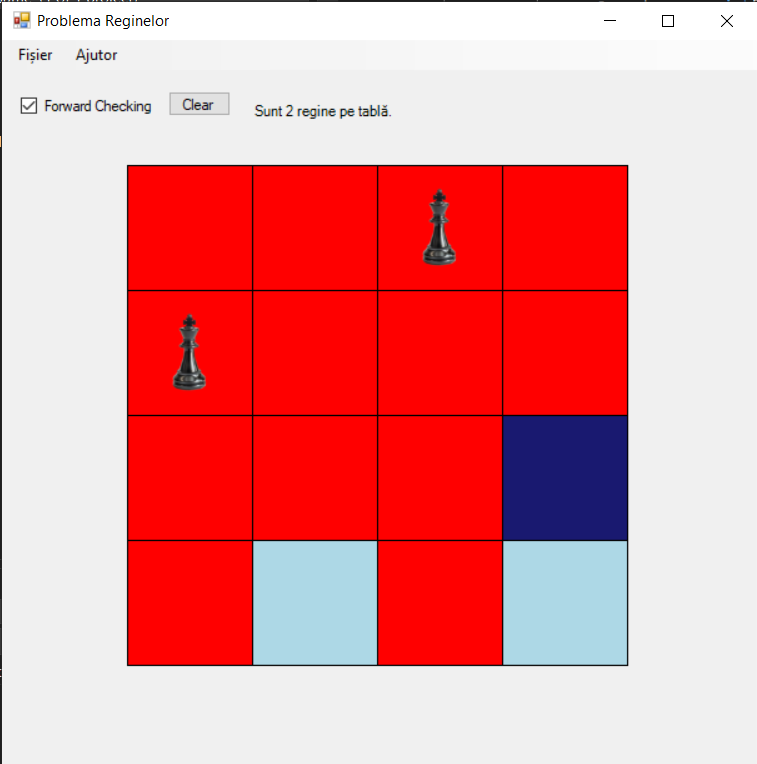

# QueensGame4x4-ForwardChecking

Acest proiect implementează o versiune a Problemei Reginelor folosind o tablă de șah 4x4. Utilizatorul poate plasa regine pe tablă, iar programul utilizează mecanisme precum forward checking pentru a evidenția celulele blocate. Scopul este să aranjezi reginele astfel încât să nu se atace între ele.

## Funcționalități

- **Plasare regine**: Utilizatorul poate plasa regine pe tablă prin click-uri.
- **Forward Checking**: O funcționalitate opțională care evidențiază celulele blocate pe baza reginelor deja plasate.
- **Resetare**: Posibilitatea de a reseta tabla pentru a începe un nou joc.

## Capturi de ecran

### 1. Ecran principal 
-la apăsarea a 4 click-uri, in urma cărora nu sunt plasate 4 regine, jucătorul pierde

### 2. Forward Checking activat

### 3. Mesaj final - joc câștigat

## Structura proiectului

- **`Form1.cs`**: Logica principală a interfeței grafice .
- **`Board.cs`**: Clasa care gestionează logica tablei de șah și a plasării reginelor.
- **`DrawBoard.cs`**: Clasa responsabilă pentru desenarea tablei și evidențierea celulelor.
- **`Game.cs`**:  Clasa care centralizează logica jocului. Aceasta coordonează interacțiunile dintre tabla de șah (Board), desenarea grafică (DrawBoard) și regulile jocului.

## Tehnologii utilizate

- Limbaj: C#
- Platformă: Windows Forms
- IDE: Visual Studio

## Despre

Acest proiect a fost dezvoltat pentru laboratorul de **Inteligență Artificială** și demonstrează aplicarea unui algoritm simplu de forward checking într-o problemă clasică de șah.

## Autor

Maftei-Gutui Robert, 2025

